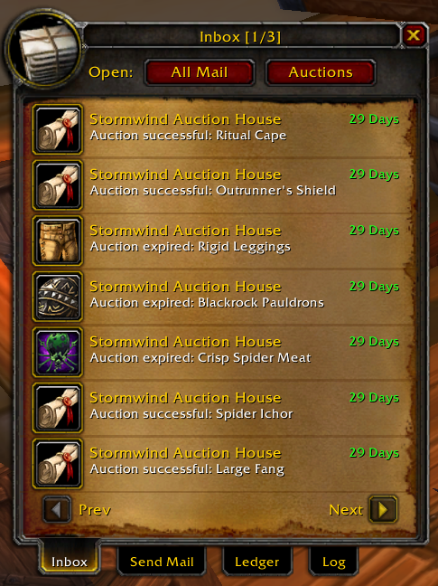
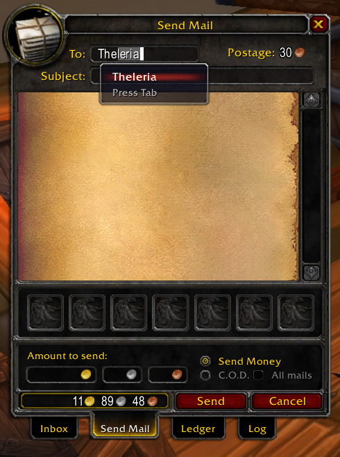
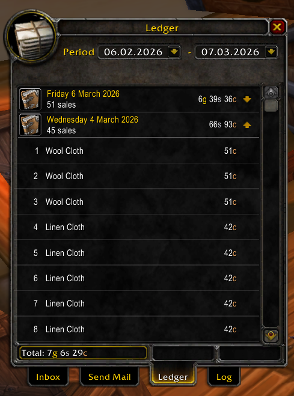
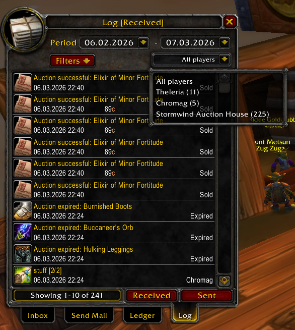
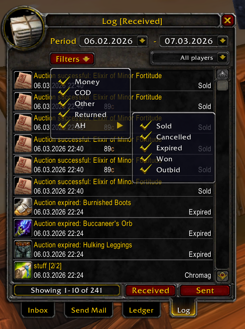

# Forged Mailbox

Upgrade your Vanilla and Turtle WoW mailbox with a powerful enhancement designed to save time and give you better control over your Auction House profits.

This addon introduces a dedicated Ledger view that clearly summarizes your daily Auction House sales, making it effortless to track your gold flow. You can expand each entry to see detailed, per-mail breakdowns, giving you full transparency over every transaction.

It also streamlines item trading with a smart multi-send workflow that automatically splits large attachment batches into separate mails. No more repetitive manual sending — just fast, smooth, and efficient mailing.

## Highlights

- **Ledger tab (daily)**
  - Shows per-day totals (e.g. total gold from Auction House sales)
  - Click a day row to expand/collapse per-mail sub-entries
  - Expanded rows show the mail subject and the money amount on the right

- **Send multiple items (multi-mail)**
  - Adds a large attachment grid (up to **21** items)
  - When you send, the addon sends **one mail per attachment** automatically
  - If you set a manual subject, it will be suffixed like `[1/5]`, `[2/5]`, …
  - Postage is calculated for multiple mails (cost is multiplied by the number of outgoing messages)

## Installation

1. Copy the addon folder to `Interface/AddOns/Forged_Mailbox`
2. Restart the client (recommended if you changed the `.toc`).

## Screenshots

## Ledger

Open a mailbox and click the **Ledger** tab.

- The main rows are grouped by day.
- Click a day row to expand to per-mail entries for that day.
- Expanded rows are intended for Auction House-related received mails (e.g. sales).

Notes:

- Per-mail money in expanded rows is only available if it was captured when the money was looted (older saved entries may show blank money values).
- The Ledger is always enabled (it is not controlled by the Log toggle).

## Send multiple items

Open a mailbox and go to the **Send Mail** tab.

### Attach items quickly

- With the mailbox open, **right-click an item in your bags** to attach it.
- To remove an item you already attached, **right-click it again** in your bags.
- The Send Mail attachment area supports up to **21** items.

### What happens when you click Send

- The addon sends **one mail per attachment**.
- If you typed a subject and you are sending multiple mails, the subject gets a counter like `[1/5]`.

### COD / money behavior

- If you enable COD and have multiple attachments, an **All mails** toggle becomes available.
  - If enabled, the COD amount applies to **each** mail.
  - If disabled, money/COD is only applied to the **first** mail.

## Other QoL

- **Open All** button to loot your inbox faster
- Prints a short chat summary when an automated open-all run finishes
- **Autocomplete** for previously used recipient names
- Returned-mail indicator arrows
- Optional **Log** tab (toggleable)

## Slash commands

Commands are registered as:

- `/fmb` (alias: `/forgedmailbox`)

Supported arguments:

- `/fmb` or `/fmb help` — show help
- `/fmb log` — toggle the **Log** tab on/off
- `/fmb clear sent` — clear Sent log
- `/fmb clear received` — clear Received log
- `/fmb clear names` — clear saved autocomplete recipient names
- `/fmb debug` — toggle debug logging

## SavedVariables

Declared in [Forged_Mailbox.toc](Forged_Mailbox.toc):

- `ForgedMailboxDB` (account-wide)
- `ForgedMailboxLogDB` (per-character)

## Notes / limitations

- This addon targets the Vanilla/Turtle WoW UI API level declared by the `.toc`.

## Files

- `core.lua` — addon initialization, hooks, slash commands
- `open_mail.lua` — inbox/open-all logic
- `send_mail.lua` — send mail helpers
- `autocomplete.lua` — recipient autocomplete
- `log.lua` — Log tab
- `ledger.lua` — Ledger tab
- `Forged_Mailbox.xml` — UI frames
